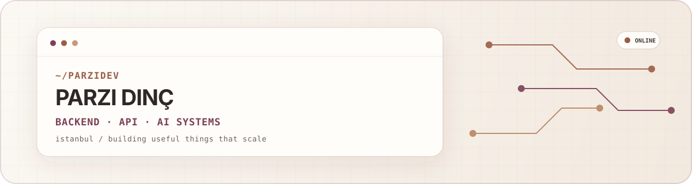

  

  
  
  
  
  

## `whoami`

I am **Parzi Dinç**, an Istanbul-based backend and systems developer working across scalable APIs, real-time services, AI products, automation, iOS and developer tooling.

- Shipped **100+ client projects** covering APIs, scraping, automation and integrations.
- Built products serving **800k+ users** and public platforms reaching **600M+ views**.
- Launched an end-to-end AI/iOS product on the App Store.
- Comfortable owning the path from product idea and API contract to deployment, observability and production debugging.
- Also experienced in gaming communities, moderation, localization and player engagement.

`currently:` building reliable tools at the intersection of backend systems, AI and useful automation.

## `flagship · discord automation platform`

**[Parzi Discord Bot](https://bot.parzi.dev)** is my main long-running automation system: a modular Discord service with **19 recurring background jobs**, event-driven moderation, community tooling, game integrations, persistent state and an OAuth-protected Quart control panel.

<strong>Recurring automation engine</strong>

- Rotates configurable bot presence states and keeps the saved voice connection alive with automatic reconnects.
- Detects live League of Legends matches, publishes team/champion data, then updates the same message with result, duration and KDA while archiving the match JSON.
- Posts scheduled mastery snapshots, tracks summoner-level changes and automatically updates a Discord channel name when the level changes.
- Watches Kick chats for configured keywords, monitors multiple streamers for live/offline transitions and periodically clears processed-message state.
- Polls LogParzi for new visitor and interaction events, sends channel/DM alerts and refreshes visit details after a delay.
- Watches Spotify playlists for newly added tracks and sends channel plus DM notifications.
- Runs birthday checks and configurable celebration messages, including calculated ages and upcoming-birthday data.
- Publishes Feetle traffic/security statistics from Cloudflare and tracks the platform's total score.
- Watches Trendyol collections and OnuAl deal feeds for new products, coupons and trending offers.
- Monitors GitHub repositories for new commits and routes project-specific updates to separate channels.
- Tracks member game, streaming and Spotify activity without replaying old state after a restart.
- Includes temperature-threshold alerts and scheduled housekeeping for automation caches and honeypot experiments.

<strong>Community, moderation & event automation</strong>

- Automatically creates or configures honeypot channels; supports softban, ban, kick, timeout-first, DM/log forwarding and race-condition protection.
- Records deleted and edited messages, forwards incoming bot DMs and rewrites X/Instagram links into embed-friendly alternatives.
- Tracks invite usage, member joins/leaves, account age, membership duration and roles; can assign an automatic join role.
- Provides owner/admin tools for purge, mute, ban/unban, kick, nicknames, role creation/colors, mass roles and channel operations.
- Adds context-aware reactions and offers searchable activity, moderation and chat-log views.

<strong>Commands, integrations & control panel</strong>

- Riot/LoL: profiles, match history, live matches, champion stats/skins/rotation, mastery, challenger ladder and gameplay analytics.
- Spotify, Fitbit, Steam, weather, water/dam status, Turkish league data, birthdays and server activity commands.
- Prefix and slash-command support with interactive, categorized help and controlled slash synchronization.
- Discord OAuth panel for presence/avatar control, task start/stop, users, roles, channels, birthdays, announcements, moderation, blacklist, honeypot, embeds, logs and chat history.
- Built with Python, discord.py, Quart, Hypercorn, SQLite/JSON persistence, aiohttp, BeautifulSoup, Spotify APIs and Docker.

## `products`

| Product | What it does | Built with |
|:--|:--|:--|
| **[Parzi Discord Bot](https://bot.parzi.dev)** | Flagship community automation platform with 19 background jobs, moderation, game integrations, persistent state and an OAuth control panel | Python, discord.py, Quart, Hypercorn, SQLite, aiohttp, Docker |
| **[StickerAI — Chibi Maker](https://apps.apple.com/tr/app/stickerai-chibi-maker/id6761774054?l=tr)** | App Store product with AI generation, credits, subscriptions, webhooks, app extensions and 14-language distribution | SwiftUI, MVVM, Vision, Cloudflare Workers, D1, fal.ai, RevenueCat |
| **[lolstat.data](https://test.parzi.dev)** | Riot match and player analytics, developer playground, OpenAPI surface, 24+ game datasets and a CatBoost-based ML prediction lab | Python, Flask, Riot API, CatBoost, scikit-learn, pandas, Docker |
| **[League Mastery](https://mastery.parzi.dev)** | Multi-region champion mastery search with player profiles, comparisons, JSON APIs and Voronoi-style visualizations | Python, Flask, Riot API, SQLite, JavaScript, Docker |
| **[timed.match](https://timed.parzi.dev)** | Match-V5 lookup that turns match and timeline data into a time-oriented report with a compact JSON API | Python, Flask, Riot Match-V5, JavaScript, Docker |
| **[LogParzi](https://log.parzi.dev)** | Self-hosted visitor analytics and security service with event tracking, IP/ASN intelligence, VPN/proxy/Tor detection, rate limits and public counters | Python, Flask, Gunicorn, Docker, JSON/TXT storage |
| **[Spoti Widget](https://spoti.parzi.dev)** | Spotify OAuth service with now-playing and history views, customizable embeds, OBS widgets, presets, caching and monitoring | Python, Flask, Spotipy, Redis, JavaScript, Docker |
| **[Fitbit Dashboard](https://fitbit.parzi.dev)** | Personal health dashboard for live steps, distance, calories, sleep, heart rate, goals, badges and activity history | Python, Flask, Fitbit Web API, local persistence, JavaScript, Docker |

## `selected systems`

| Product / system | What I built | Core stack |
|:--|:--|:--|
| **[Feetle.lol](https://feetle.lol)** | Viral public platform that reached **600M+ views** | Python, JavaScript, web platform engineering |
| **[Kick API](https://kick.parzi.dev)** | Public streaming API used by **1,000+ users** | Python, REST, real-time services |
| **[Mastery API](https://mastery.parzi.dev)** | Riot API platform used by **500+ developers** | Python, APIs, caching, automation |
| **[ClashScope / CoC Analytics](https://coc.parzi.dev)** | Player, clan, war and CWL analytics with snapshots, caching, tests and rate limiting | Flask, SQLite, Gunicorn, Docker |
| **[Streaming & OBS tooling](https://kick.parzi.dev)** | WYSIWYG overlays, event monitors, subathon timers and multi-client state synchronization | WebSocket, Socket.IO, Python, JavaScript |

## `open source snapshots`

| Repository | Notes |
|:--|:--|
| [`docker-steam-hour-booster`](https://github.com/parzidev/docker-steam-hour-booster) | Dockerized multi-AppID Steam hour booster with persistent Steam Guard authentication |
| [`100-python-apps`](https://github.com/parzidev/100-python-apps) | A growing collection of focused Python mini-apps |
| [`magic-png`](https://github.com/parzidev/magic-png) | Compact C# image utility |

## `toolbox`

  

**Backend:** FastAPI · Flask · Node.js · Express · REST · GraphQL · WebSocket  
**Automation:** scraping · Selenium · Scrapy · integrations · bots  
**Data & AI:** SQLite · D1 · MongoDB · CatBoost · fal.ai · Gemini · analytics  
**Mobile:** SwiftUI · MVVM · Combine · Vision · iOS extensions  
**Infrastructure:** Docker · Nginx · Gunicorn · GitHub Actions · Cloudflare · AWS · Vercel

## `live signals`

  

<strong>experience & education</strong>

### Experience

- **Freelance Backend Developer — Fiverr** · 2022–present  
  International client work across APIs, automation, scraping and integrations.
- **Founder & Full-Stack iOS Developer — StickerAI** · 2026–present  
  End-to-end product, iOS, AI generation pipeline and backend ownership.
- **Independent Backend & Systems Developer**  
  High-traffic APIs, real-time services, analytics, observability and internal tools.
- **Community Manager & API Contributor — Heavy Metal Machines** · 2019–2020  
  Community growth, engagement, operations and API-supported workflows.
- Additional experience in League of Graphs Turkey community operations, export/e-commerce web support and NDA game systems.

### Education

- Software Engineering — Istinye University
- Management Information Systems — Anadolu University
- Computer Programming — Kastamonu University
- Turkish: native · English: B2

## `connect`

  <a href="https://parzi.dev">Website</a> ·
  <a href="https://parzi.dev/cv.html">CV</a> ·
  <a href="https://www.linkedin.com/in/parzi/">LinkedIn</a> ·
  <a href="https://x.com/parzidev">X</a> ·
  <a href="https://www.instagram.com/parzi.dev">Instagram</a> ·
  <a href="https://discord.com/users/1013951210035875882">Discord</a> ·
  <a href="mailto:me@parzi.dev">Email</a>

<code>build small · ship often · scale what matters</code>

